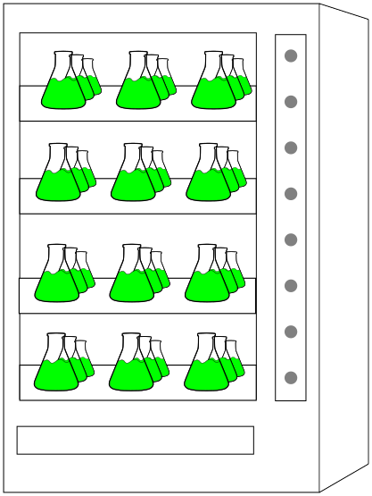

# popmachine

Storage of microbial population growth data.

## What is popmachine?
popmachine provides organization of your population growth data that:
* organizes of all growth datasets, and provides easy access to it through searching
* encourages standardized metadata descriptions
* provides typical data pre-processing steps to support reproducibility

## What popmachine is *not*:
popmachine is not a one size fits all growth storage solution: popmachine was deliberately designed to organize data on the **project** level, meaning a set of experiments that share common experimental designs and metadata. You very likely will find that trying to use this software to store all your datasets will soon lead to overlapping and/or meaningless annotations that limit usefulness
